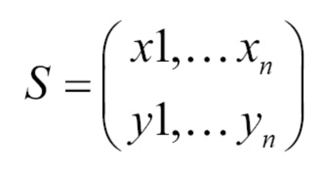

# CV Features

### Fast(Features from Accelerated and Segments Test)

取像素p周围的16个点，将点分为三类（亮，暗，接近），如果有超过8个点亮于或暗于p，则p为关键点

特点：没有方向性，没有多尺度（大尺度的角点可能不满足有8个亮/暗于）

### ORB

增加多尺度图像金字塔。以不同尺度大小表示统一张图，然后使用FAST算法检测每一张图的关键点，有partial scale invariant

然后检测intensity change求方向，引入intensity centroid，表示corner质量的中心。centroid到center的偏移算出orientation

Center of mass - C

$C=(\frac{\sum\limits_{x,y}xI(x,y)}{\sum\limits_{x,y}I(x,y)}, \frac{\sum\limits_{x,y}yI(x,y)}{\sum\limits_{x,y}I(x,y)})$

构造center和intensity centroid的向量，角度为

$\theta=atan2(\sum\limits_{x,y}yI(x,y), \sum\limits_{x,y}xI(x,y))$

ps. $arctan2(y,x)$等同于$arctan(\frac{y}{x}) ,\;(x\neq0)$情况，计算以原点为起点，指向$(x,y)$的向量与x轴正方向之间的角度

注意y和x反过来

可以将图片旋转到标准角度再计算ORB以获得rotation invariance

### Brief(Binary Robust Independent Elementary Feature)

*takes all keypoints found by fast and convert it into a binary feature vector*

> Brief start by smoothing image using Gaussian kernel to prevent descriptor from being sensitive to high frequency noise

1. select first pixel around keypoint with Gaussian distribution.($\mu, \sigma$)
2. select second pixed around the first pixel with Gaussian distribution.($\mu, 2\sigma$)
3. Two pixels form as patch(square of width and eight)
4. If the frist pixel is birghter than second, assign 1 to bit.
5. for each keypoint in image repeat step 1-4 for 128/512 times. (Each keypoint-wise)

Brief **旋转敏感**

提出steer BRIEF，增加旋转矩阵$R_{\theta}$

$S_{\theta}=R_{\theta}S$

分成多个角度旋转S

-----

*👇没有太看懂*

steered BRIEF operator:

$g_n(p,\theta)=f_n(p)|(x_i, y_j)\in S_{\theta}$

improve variance and correlation over steered BRIEF $\to$ rBRIEF

**rBRIEF algorithm**: 

1. Run each test against all training patches.
2. Order the tests by their distance from a mean of 0.5, forming the vector T.
3. Greedy search:
   - Put the first test into the result vector R and remove it from T.
   - Take the next test from T, and compare it against all tests in R. If its absolute correlation is greater than a threshold, discard it; else add it to R.
   - Repeat the previous step until there are 256 tests in R. If there are fewer than 256, raise the threshold and try again

[OpenCV Implementation](https://gist.github.com/deepanshut041/d73d20bfd77eb27c96090d2a3c171fcc#file-orb-ipynb)
