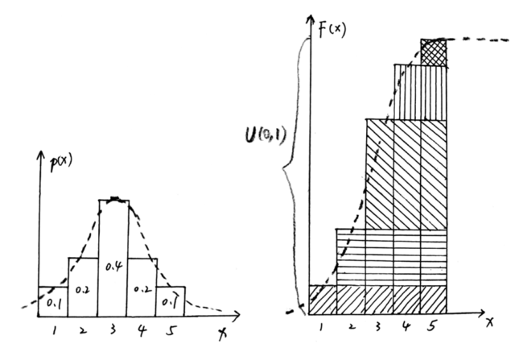
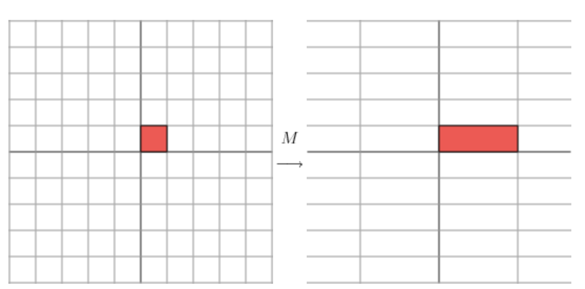
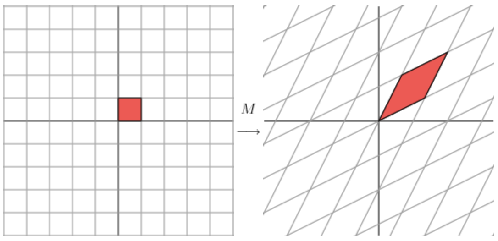
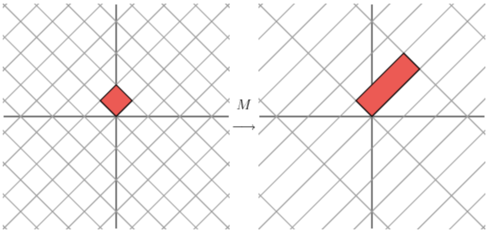
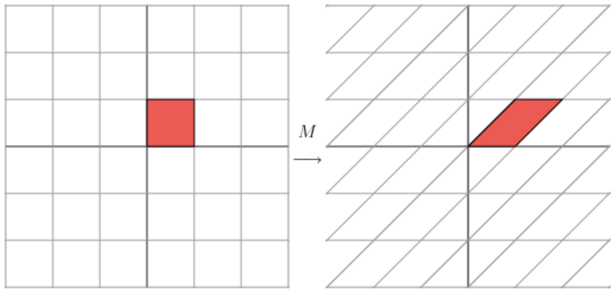
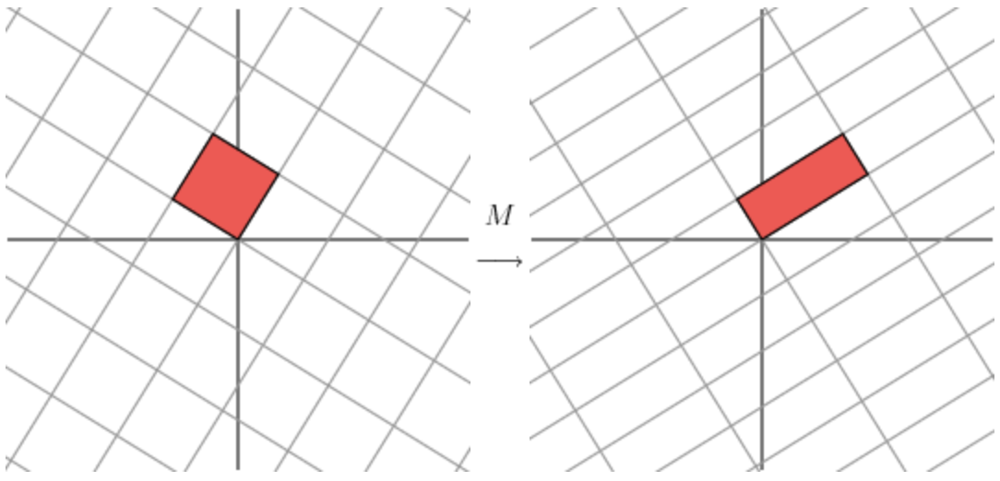

# Math Related

## EM算法

> 用于当求出一个变量就可以求另外一个变量，且此时两个都未知的情况

X为随机变量，Z为隐变量，$\theta$为需要估计的参数

两步：estimate步骤，maximization步骤

1. 初始化$\theta^{old}$

2. E：由参数$\theta$得到的隐变量Z的后验分布$p(Z|X,\theta^{old})$，计算$X,Z$联合分布关于Z的期望$Q(\theta,\theta^{old})=\sum_{z}{p(Z|X,\theta^{old})\ln{p(X,Z|\theta)}}  $，即对数似然函数$L(\theta)=\log{p(X,Z|\theta)}$的期望。

3. M：选择最大化期望的参数，作为新的参数$\theta^{new}=\max\limits_{\theta}{Q(\theta,\theta^{old})}$。检验停止条件，满足停止；不满足$\theta^{old}\leftarrow \theta^{new}$，继续迭代

参考K-Means算法：

1. 随机选取初始化类别中心

2. E：按距离把每个点分配到类别，类似已知参数（类别中心），计算后验分布

3. M：根据选取的点，重新计算类别中心，类似已知类别分布（点的类别），最大化参数（类别中心）

## 采样

#### Basic Sampling 基本采样法/逆变换采样法

> 适用于CDF和反函数易求情况

$X$为任意分布连续随机变量（需sample的r.v.），$F_x$为$X$的CDF（累积概率密度函数，均匀分布），则随机变量$Y=F_x\sim U(0,1)$。

逆变换采样，$F_x^{-1}(Y)$和$X$同分布，使$y\sim U(0,1)$，则$x=F_x^{-1}(y)$即为生成的随机样本。「CDF定义」

证明：

$Pr(F^{-1}_x(U)\leq X)$

$=Pr(\{y|y=F_x^{-1}(u),\;u\sim U(0,1)\}\;\leq x)$    // 定义

$=Pr(\{y|F_x(y)=u\sim U(0,1)\}\;\leq x)$    // CDF表示

$=Pr(\{F_x(y)|F_x(y)=u\sim U(0,1)\}\;\leq F_x(x))$    // 同时作用$F_x$，单调

$=Pr(\{u|u\sim U(0,1)\}\leq F_x(x))$    

$=Pr(U\leq F_x)$    // v$\to$r.v.

$=F_x$    // 由于当$U$为均匀分布时，$Pr(U\leq y)=y$

**步骤：求累计密度函数的反函数**

1. 已知$z\sim U(0,1)$，采样$r.v.\;Y,\;\; p(y)=\frac{1}{\pi}\frac{1}{1+y^2}$标准柯西分布

2. **求$Y$的CDF**：$h(y)=\int_{-\infty}^{y}{p(y)dy}=\frac{1}{\pi}\arctan{y}+\frac{1}{2}$ 「注意积分的常数项，$h(+\infty)=1$ 」，$H(Y)$服从均匀分布同$Z$，即$Z=H(Y)$

3. **计算反函数**，$Y=H^{-1}(Z)$即为采样分布。$y=h^{-1}(z)=\pi \tan{z-\frac{1}{2}}$

可以理解为$H(Y)=Z$是均匀分布的，即$Y$的累计概率密度为均匀的。反过来，可以使用均匀概率密度产生$Y$，逆过程将均匀分布$Z$累计分摊成$Y$。

#### 高斯分布采样

> 由于高斯分布CDF不是初等函数，采用换坐标系（类似高斯积分求解）

单变量不易求，双变量$X,Y$服从高斯分布，相互独立

$p(X)=\frac{1}{2\pi}e^{-\frac{1}{2}X^2},\;\;p(Y)=\frac{1}{2\pi}e^{-\frac{1}{2}Y^2}$

联合概率密度

$p(x,y)=\frac{1}{2\pi}e^{-\frac{X^2+Y^2}{2}}$

换坐标系$X=R\cos{\theta},\;\;Y=R\sin{\theta}$

$\int^{\infty}_{\infty}\int^{\infty}_{\infty}{ \frac{1}{2\pi}e^{-\frac{X^2+Y^2}{2}}dxdy } = \int^{2\pi}_{0}\int^{\infty}_{0}{ \frac{1}{2\pi}e^{-\frac{R^2}{2}}Rd\theta dR }=1$

求边缘累积概率CDF

$P_R(R\leq r)=\int^{2\pi}_{0}\int^r_{0}{ \frac{1}{2\pi}e^{-\frac{R^2}{2}}Rd\theta dR } = 1-e^{-\frac{R^2}{2}}$

$P_\theta(\theta\leq\phi) = \int^{\phi}_{0}\int^{\infty}_{0}{ \frac{1}{2\pi}e^{-\frac{R^2}{2}}Rd\theta dR } = \frac{\phi}{2\pi}$

要求CDF为均匀分布：显然$P_\theta(\theta\leq\phi)$均匀分布

要使$P_R(R\leq r)$为均匀分布，求R的分布函数

令$z=F_R(r)=1-e^{-\frac{r^2}{2}}$

反函数$r=F_R^{-1}(z)=\sqrt{-2\ln(1-z)}$

即Z服从均匀分布时，R的分布函数为$F_R$

最后选取$U_1,U_2\sim U(0,1),\;\; U_1=\frac{\theta}{2\pi},\; U_2=1-Z$，可得$\theta=2\pi U_1, \; R=\sqrt{-2\ln(U_2)}$。带入$X=R\cos{\theta},\;\;Y=R\sin{\theta}$，得到的$X,Y$服从高斯分布

上述即为 **Box-Muller变换**

$X=\cos{2\pi U_1}\sqrt{-2\ln{U_2}}$

$Y=\sin{2\pi U_1}\sqrt{-2\ln{U_2}}$

*Ref:*

*[https://zhuanlan.zhihu.com/p/38638710](https://zhuanlan.zhihu.com/p/38638710), [https://drivingc.com/p/5c46c4c64b0f2b64f2179af0](https://drivingc.com/p/5c46c4c64b0f2b64f2179af0)*

#### 接受/拒绝采样

> 从容易采样的分布逼近

要采样$p(z)$，选取容易采样的分布$q(z)$（eg. 高斯分布），使$\forall z,\;p(z)\leq kq(z)$。采样$q(z)$，对于每个采样结果，接受率为$\frac{p(z)}{k\cdot q(z)}$，则采样结果近似逼近$p(z)$。

**步骤**：

1. 从参考分布中采样样本$z_i$

2. 从$U(0,1)$均匀分布中选择随机数$u_i$

3. 如果$u_i<\frac{p(z_i)}{k\cdot q(z_i)}$，则接受采样样本$z_i$，否则拒绝。重复直到接受

包络$q(z)$越紧，采样效率越高。

*Ref: [https://drivingc.com/p/5c46be544b0f2b64f2179aea](https://drivingc.com/p/5c46be544b0f2b64f2179aea)*

### 概率和似然

**概率(probability)**：模型参数$\theta$确定，观测为变量。给定参数为$\theta_i$，不同观测样本$O$出现的概率

**似然(likelihood)**: 观测确定的，参数为变量。对于不同参数，出现观测点$O$的概率（参数对于出现$O$的影响）

Ref: [https://yangfangs.github.io/2018/04/06/the-different-of-likelihood-and-probability/](https://yangfangs.github.io/2018/04/06/the-different-of-likelihood-and-probability/)

---

## SVD 奇异值分解

> Perpframes = Orthonormal basis (mutually perpendicular unit vectors)

#### Aligner

**Motivation**: *Get perpframe into the xy-axis*

Loading perpframe vector into rows of matrix

$\overrightarrow{p_0}=\begin{bmatrix} a \\ b \end{bmatrix},\;\overrightarrow{p_1}=\begin{bmatrix} c \\ d \end{bmatrix}$

and aligner matrix is 👇

$aligner = \begin{bmatrix} a & b \\ \hline c & d \end{bmatrix}$

gif illustration: http://websites.uwlax.edu/twill/svd/perpframes/aligneraction.gif

#### Hanger

**Motivation**: *Get xy-axis onto the perpframes*

Loading perpframe vector into column of matrix

$\overrightarrow{p_0}=\begin{bmatrix} a \\ b \end{bmatrix},\;\overrightarrow{p_1}=\begin{bmatrix} c \\ d \end{bmatrix}$

and hanger matrix is 👇

$hanger=\left [ \begin{array}{c|c} \begin{matrix} a \\ b \end{matrix} &  \begin{matrix} c \\ d \end{matrix} \end{array} \right ]$

git illustration: http://websites.uwlax.edu/twill/svd/perpframes/hangeraction.gif

#### Stretcher

**Motivation**: stretches in the x and y direction

Loading stretche factor into diagonal matrix

$stretcher=\begin{bmatrix} a & 0 \\ 0 & b \end{bmatrix}$

a is factor of the first dimension, b is the second one.

0 means squash, a<0 means flipping

Illustration: http://websites.uwlax.edu/twill/svd/stretchers/stretcher5.gif

**changing dimensions**: 2D $\to$ 3D by a 3$\times$2 matrix

illustration: http://websites.uwlax.edu/twill/svd/stretchers/3dstretch.gif

#### SVD (singular value decomposition)

Product of (hanger)(stretcher)(aligner)

**Every** $m \times n$ matrix has a SVD

---

## Another explaination

> http://www.ams.org/publicoutreach/feature-column/fcarc-svd

**For diagonal matrix**: horizontally or/and vertically stretch, no change to angles

$M=\begin{bmatrix}3 & 0 \\ 0 & 1 \end{bmatrix}$

**For symmetric matrix**: rotate and stretch

$M=\begin{bmatrix}2 & 1 \\ 1 & 2 \end{bmatrix}$

Then rotate the grid (orthogonal unit vector) by 45 degree

like diagonal matrix

For rotated vector $v_i$, only stretch in one direction but no rotation. So can be described as $Mv_i=\lambda_iv_i$.👈**Eigenvalue and eigenvector**. 

👆**Transform from orthogonal vectors to orthogonal vectors**

**For general matrix**

$M=\begin{bmatrix}1 & 1 \\ 0 & 1 \end{bmatrix}$

Rotate grid iteratively, until 58.28 degrees, the origin grid are orthogonal

**Express using vector**

denote the grid as orthogonal unit vector $\overrightarrow{v_1}, \overrightarrow{v_2}$ (to find)

denote direction of result $u_i$, scale of result $\sigma_i$

then

$Mv_1=\sigma_1u_1,\; Mv_2=\sigma_2u_2$

since  $\overrightarrow{v_1}, \overrightarrow{v_2}$ are orthogonal unit vectors, $x=(v_1\cdot x)v_1+(v_2\cdot x)v_2$

so

$Mx=(v_1\cdot x)Mv_1+(v_2\cdot x)Mv_2$

$Mx=(v_1\cdot x)\sigma_1u_1+(v_2\cdot x)\sigma_2u_2$

$Mx=u_1\sigma_1v_1^Tx+u_2\sigma_2v_2^Tx$, for $v\cdot x=v^Tx$

$M=u_1\sigma_1v_1^T+u_2\sigma_2v_2^T$

Expressed as $M=U\Sigma V^T$ 

