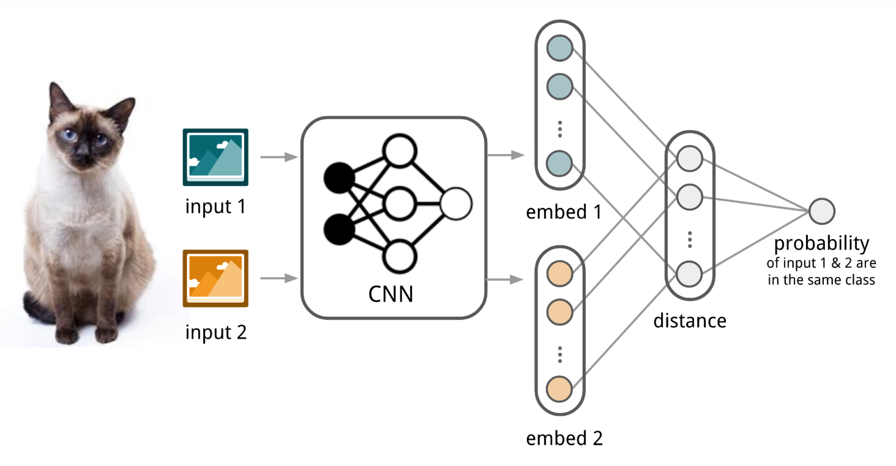

# Meta-Learning

> Learning new concepts and skills faster and efficiently
> 
> no need of large samples and training

Focus on *supervised learning*, *reinforcement learning* tasks

Model should be trained over a multiple learning task and optimized on a distribution of tasks.

Optimal model parameters: $\theta^*=\operatorname{arg}\min_{\theta}\mathbb{E}_{D\sim p(D)}[\mathcal{L}_{\theta}(D)]$

### Metric-Based

Predict the **distance** of data sample and support set samples

Learn a  metric or distance function over objects $k_{\theta}$

$P_\theta(y \vert \mathbf{x}, S) = \sum_{(\mathbf{x}_i, y_i) \in S} k_\theta(\mathbf{x}, \mathbf{x}_i)y_i$

#### Siamese Network

Training two identical network to output the probability of two images belonging to the same class.

Two network share same weights and network parameters.

1. Encode two images via embedding function $f_{\theta}$
2. Calc L1-distance and converted to probability $p$
3. Cross entropy loss function $\mathcal{L}(B) = -\sum_{(\mathbf{x}_i, \mathbf{x}_j, y_i, y_j)\in B} \mathbf{1}_{y_i=y_j}\log p(\mathbf{x}_i, \mathbf{x}_j) + (1-\mathbf{1}_{y_i=y_j})\log (1-p(\mathbf{x}_i, \mathbf{x}_j))$
4. Choose class with maximum probability 

Adoption of pre-trained model(like transfer learning)

---

#### Matching Network

To be continued @ [https://lilianweng.github.io/lil-log/2018/11/30/meta-learning.html](https://lilianweng.github.io/lil-log/2018/11/30/meta-learning.html)
