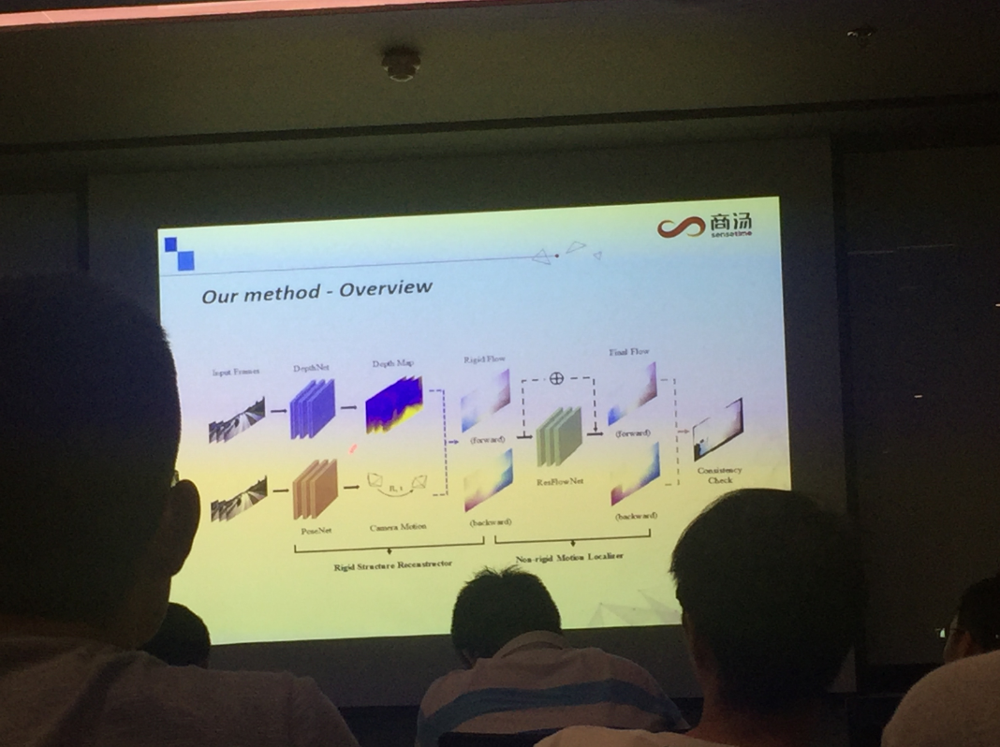

# VQA  
#### Instance-aware Image and Sentence Matching with Selective Multimodal LSTM

* Motivation:  
  1. instance aware matching not only using global similarity  
  2. only partial salient instance pairs describing the same semantic concept can actually be associated and contribute to the global similarity  
  
* Model:
  1. extracts their instance candidates.  
  2. exploit context attention scheme to selectively attend to instance pairs.
    * saliency maps
    * combine saliency weighted representations
    * global context as reference
  
#### Hierarchical Question-Image Co-Attention for Visual Question Answering

* Motivation:
  1. introduce question attention
  2. hierarchical reasoning
* Model:  
  1. Word-level feature -- CNN max-pooling \(uni/bi/trigram\) -- \> phrase level -- LSTM encoding -- \> question level
  2. Co-Attention Parallel:
    * connect image-question pair's feature similarity = \> affinity matrix
    * affinity as feature to predict attention maps
  3. Co-Attention Alternating:
    * question to vec
    * question summary attention on image feature repre.
    * image feature attention on question repre.
    
  4. Encode recursively using MLP, predict from 3 level.

---

# Deep Gaussian Process Model

GP: to handle sparse dataset scenarios -> massively missing data  
deep GP: mean function(deep) + covariance function -- propagating uncertainly around network  
idea: automatically determine number of layer and hidden nodes to develop variants of Gaussian process for multiview learning  

#### Further reading

Deep GP: deep belief networks(semantics) + priors in bayesian mmodels(experience)  
Non-parametric, continuous variables  
X -f-> H -f-> H -f-> Y  

#### Dynamics

t -- > H --> Y : Y form a multivariate time-series, then H also has to be one
dynamics encoded in covariance matrix $K$

---

# Papers

## GeoNet Unsupervised Learning of Dense Depth, Motion Field and Camera Pose
* depth，camera pose slam，optical flow  
前两静态恢复，光流动态  
两张图 correlation  
相同的texture，临近相同texture  
pipeline  
Network Architecture  
  
1. 刚性物体结构  
2. 非刚性运动情况  
network  
* deep map确定静止物体  
* pose net 判断角度变化，对运动物体位置修正  
* resflow光流动态恢复  

## Automatic Academic Paper Rating Based on Modularized Hierarchical Convolutional Neural Network

#### Related work:

* LSTM+linear regression output
* convolutional layer to extract local feature
* 2*conv: encode sentence + encode essay
* attention mechanism

#### Motivation:

* score affected by writing and _title_, _author_, _abstract_, _main_ _context_
* propose task
* modularized hierarchical convolutional nn model
* hierarchical structure from word to sentence  
* parts contribution difference  

#### Proposed method:

1. one hot embedding to dense vector x_i of word  
2. attention based CNN in word to get s_i of sentence  
3. attention based CNN in to encode s_i to m_i of module  
4. title only use aCNN word level to sentence level  
5. author weight average method \gamma_i * a_i --> weight * embedding vec(learned)  
6. module repre aggregate --attention pooling-->paper level repre d --softmax--> probability  

#### details of aCNN:

1. vec和weight矩阵在element-wise相乘，h(filter size)*k(vec dimension), h vec row concatenation each position generate h*k matrix  
2. relu  activation  
3. 一个filter扫一次全文产生结果为m-h+1（m: vec sequence，h: filter size) * h * k, filter-wise  
4. n filter produce m-h+1 * h * k * n feature maps, column concatenation, c^i(row) repre position i in all feature maps  
5. attention -> contribution of each feature map to form high level repre  
6.   
7. z_i refer to feature at each location i  
8. z_i^T * z_i == constant  
9. u_w learned vec for attention  
10. \alpha for softmax
11. get weight: u ([feature map], [batch X seqlen X inputsize]) matmul ones(input size) , mul along seq_len
12. attention mul: atten apply to rnn output, get [batch X inputsize] tensor, seq(window part) weight

#### Analysis

* remove attention mechanism drops 0.9% --> attention decide relative weights of modules (different contribution of textual content)
* remove module drops 6.4% --> 
* remove paper module:  
  author > conclusion > abstract > method (high variance in papers, model may not capture unified internal pattern) > title
